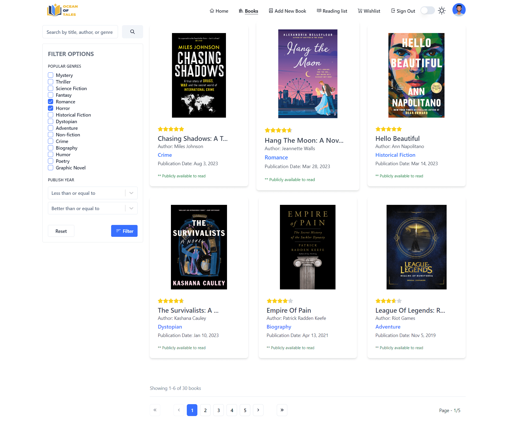
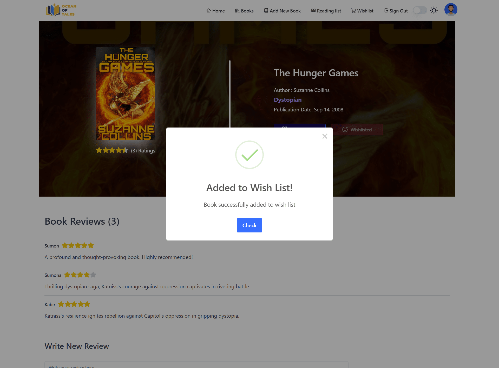
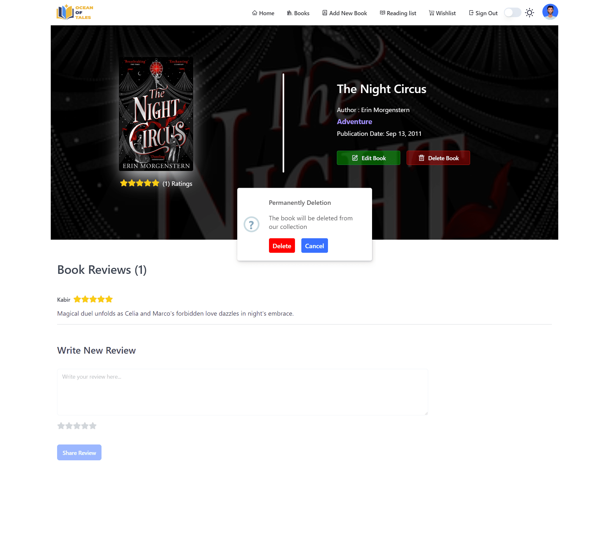
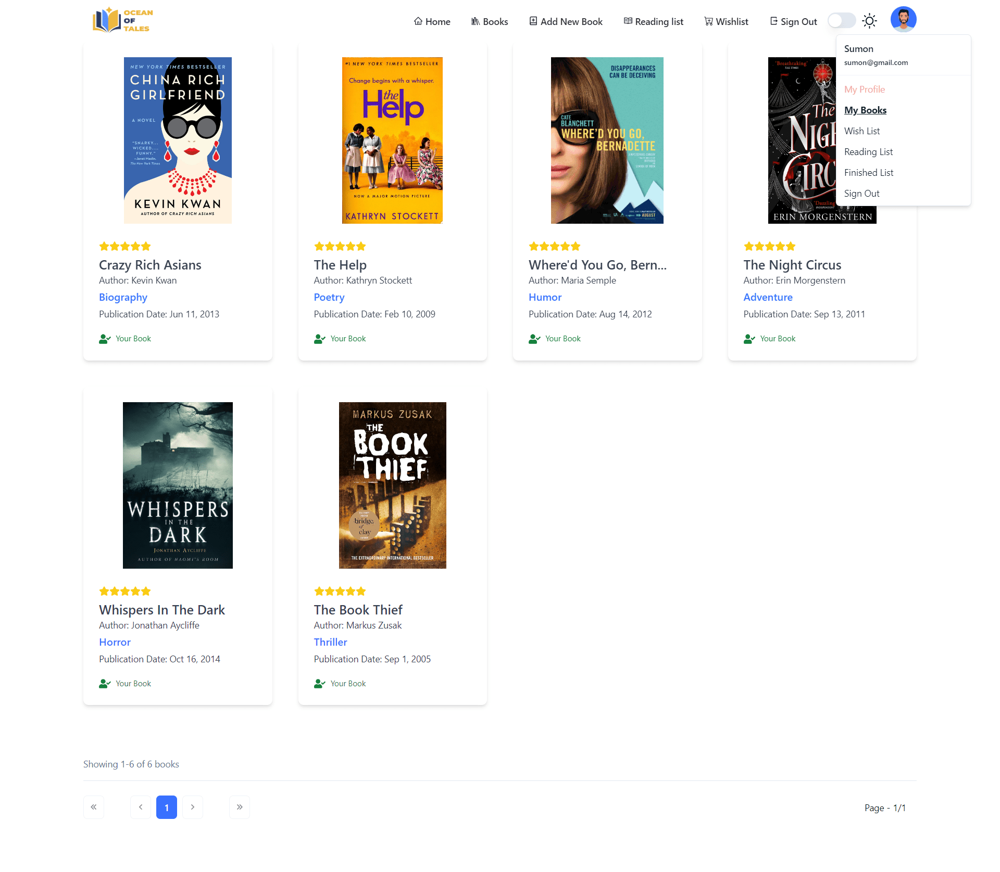
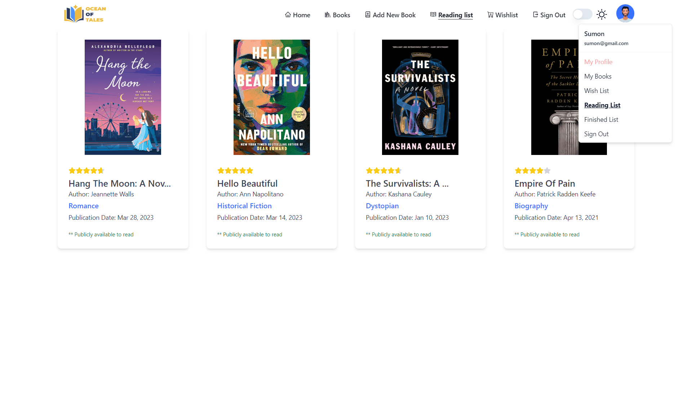

# Ocean Of Tales

- Live Frontend : [oceanoftales-client](https://oceanoftales.web.app)
- Live Backend : [oceanoftales-server](https://oceanoftales.vercel.app)
- Backend Github : [source-code-oceanoftales-server](https://github.com/ShahariarRahman/oceanoftales-server)

 
   

      <h2>Home Page</h2>
      

         
         
      

   

   

      <h2>Login</h2>
      

         
           
      

   

   

      <h2>Sign up</h2>
      

         
          
      

   

   

      <h2>Books</h2>
      

         
         
      

   

   

      <h2>Add New Book</h2>
      

         
         
         
      

   

   

      <h2>Update Book</h2>
      

         
         
      

   

   

      <h2>Book Details</h2>
      

         
         
         
         
      

   
 
   

      <h2>My Books</h2>
      
 
         
         
      

   

   

      <h2>My Wish List</h2>
      

         
         
      

   

   

      <h2>My Reading List</h2>
      

         
         
      

   

   

      <h2>My Finished List</h2>
      

         
         
      

   

